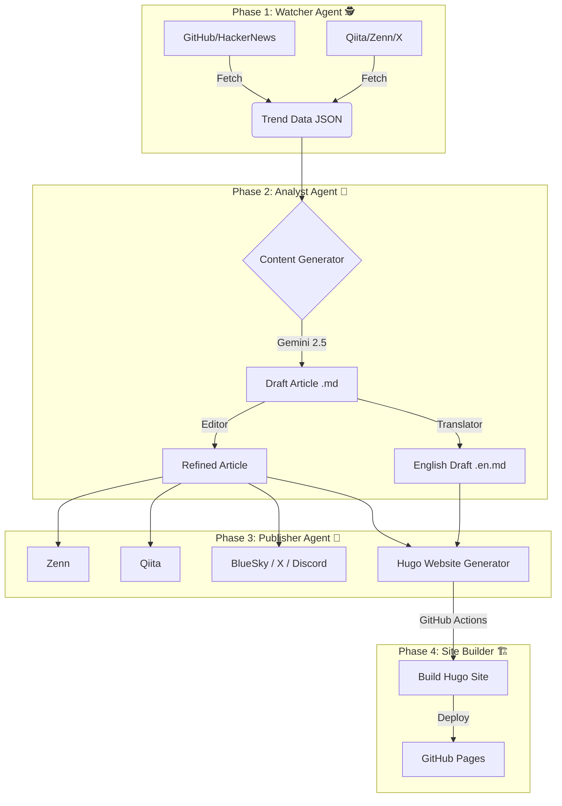

# TechTrend Watch 🚀 (Automated Tech Media)

[](https://github.com/shironaganegi/TechTrend/actions/workflows/daily_report.yml)


**TechTrend Watch** は、日々の技術トレンドを全自動で収集・分析し、記事化して複数のプラットフォーム（Zenn, Qiita, 自社サイト）へ配信する、AI駆動型の完全自動化メディア運用システムです。

## 📖 概要 (Overview)

このプロジェクトは、人間が一切介入することなく、以下のプロセスを**毎日3回（07:00, 12:00, 19:00 JST）** 自動実行します。

1.  **トレンド収集**: GitHub, HackerNews, ProductHunt, Qiita, Zenn, X(Twitter) から話題のツールや記事を収集。
2.  **選定・執筆**: Gemini 2.5 Flash がトレンドデータを分析し、最もバズる可能性の高いトピックを選定。エンジニア向けの解説記事を執筆。
3.  **多言語対応**: 日本語記事に加え、英語翻訳版も自動生成。
4.  **収益化**: Google AdSense による広告収益（※アフィリエイトは廃止し、コンテンツ価値とAdSense一本に集中）。
5.  **マルチ配信**:
    *   **Zenn**: 日本語記事をドラフト投稿（自動公開可）。
    *   **Official Website**: Hugoで構築された自社サイトへ日英両方の記事をデプロイ。
    *   **Qiita/BlueSky/X(Twitter)**: 各プラットフォームへ拡散。
    *   **Discord**: 運営者へ通知。

🔗 **Official Website**: [TechTrend Watch](https://techtrend-watch.com/)

## 🏗 アーキテクチャ (Architecture)



## ✨ 主な機能 (Features)

*   **Triple-Daily Update**: 1日3回（朝・昼・夜）の高頻度更新で、最新トレンドを逃さずキャッチ。
*   **Smart Trend Mining**: 過去の投稿履歴を参照し、重複を避けつつ、今最も熱い「旬」のネタをピックアップ。
*   **Global Reach**: 日本語記事だけでなく、英語版記事も生成しグローバルなSEO需要に対応。
*   **Quality-First Content**: E-E-A-Tを重視し、独自の解説・比較・FAQ・実装上の注意点を含む高品質記事を生成（Google AdSense 基準準拠）。
*   **Zero-Cost Operation**: GitHub Actions と GitHub Pages を活用し、**サーバー代・ドメイン代・運用費すべて0円**で稼働。
*   **SEO Optimized**: Hugo + PaperMod テーマによる高速な自社サイト構築。

## 📂 ディレクトリ構成 (Refactored)

```text
.
├── .github/workflows/   # GitHub Actions (自動実行定義)
├── src/                 # アプリケーションソースコード
│   ├── agent_watcher/       # トレンド収集エージェント
│   ├── agent_analyst/       # 分析・執筆エージェント
│   │   ├── content_generator.py
│   │   └── llm.py           # Gemini API連携
│   ├── agent_publisher/     # 配信エージェント
│   │   ├── distributor.py   # 配信オーケストレータ
│   │   └── platforms/       # 各プラットフォーム連携
│   └── shared/              # 共通基盤 (Config, Logger)
├── articles/            # 日本語記事アーカイブ (Zenn互換)
├── data/                # データストア
│   ├── articles_en/     # 英語記事アーカイブ
│   ├── prompts/         # AIプロンプト定義
│   └── ads.json         # 広告設定
├── logs/                # アプリケーション実行ログ
├── tests/               # ユニットテスト (将来用)
└── website/             # Hugo 自社サイト
```

## 🚀 セットアップ (Local Development)

### 1. インストール
```bash
git clone https://github.com/shironaganegi/TechTrend.git
cd TechTrend
pip install -r requirements.txt
```

### 2. 環境変数設定 (`.env`)
以下の変数を設定してください。
```ini
GEMINI_API_KEY=your_key
QIITA_ACCESS_TOKEN=your_token
BLUESKY_HANDLE=your_handle
BLUESKY_PASSWORD=your_password
DISCORD_WEBHOOK_URL=your_webhook
X_API_KEY=your_key
X_API_SECRET=your_secret
X_ACCESS_TOKEN=your_token
X_ACCESS_SECRET=your_secret
ZENN_AUTO_PUBLISH=false
```

---
Author: **TechTrend Watch 編集部**
Powered by Gemini & GitHub Actions
